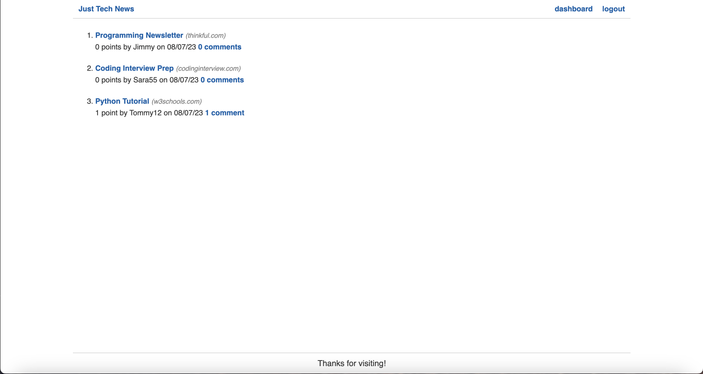
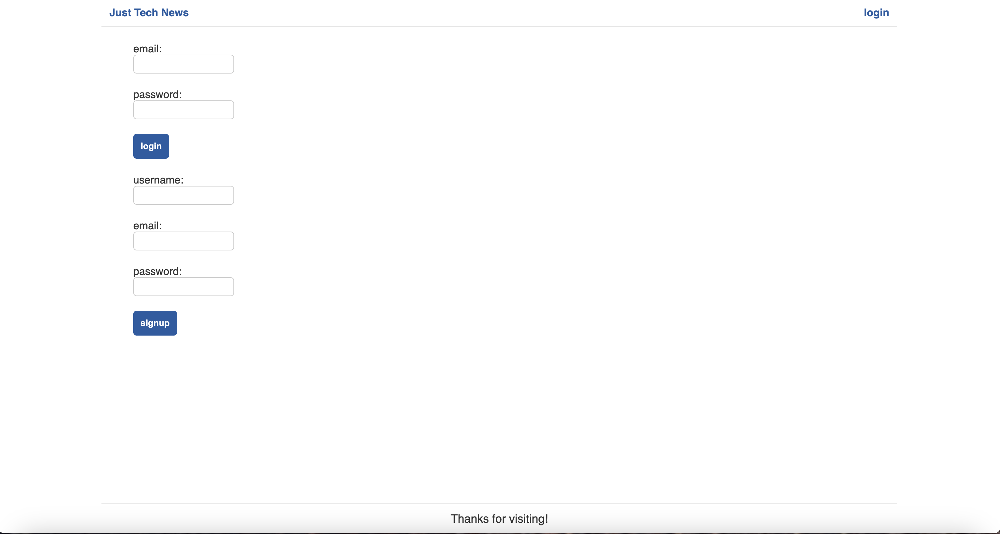
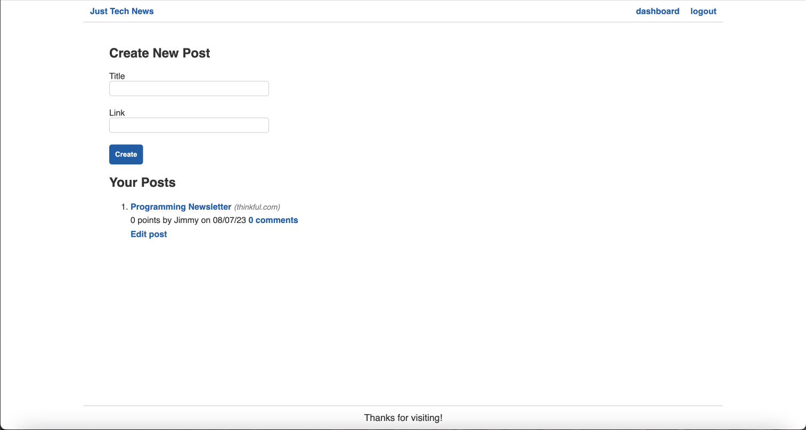
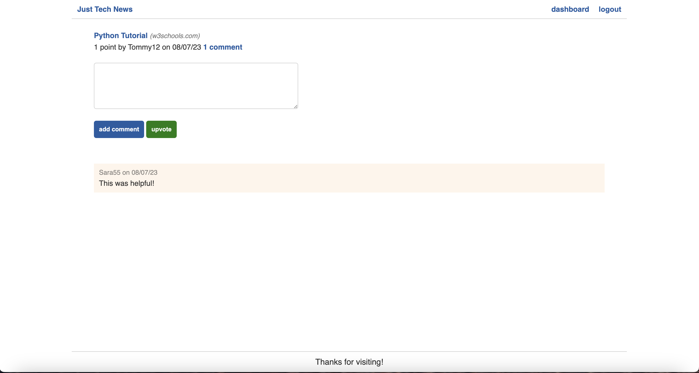

# Python-Newsfeed

## Description
This application is a news feed that allows users to post a topic and link to that website. It uses Python and Flask on the backend to manage the database.

## Installation
N/A

## Usage
A user must navigate to the website by clicking on the heroku link provided. Once there, the user will see a homepage which displays the title and current blog posts.

Once you try to click on a post you will be able to see the comments, but you will not be able to comment yourself. In order to create posts or comment on posts, the user will need to login. If you don't already have a login, you will need to click on sign-up instead. You will be prompted to enter a username, email and password then can hit enter.

After you login, you will be taken to the dashboard page, which displays your previous posts and has the option to create a new post. You will also notice that the user now has the option to logout as well. 

The final option on the website is to click on a specific post and be taken to that website. However, you can also click on the comments button and leave a comment or upvote as well. If you choose to leave a comment, it will then be displayed under the post with your name and the date it was posted. 

Below is a link to the deployed application:

https://newsfeed-blog-jacone626-d8ee350ef39f.herokuapp.com/

## Credits

Coding Bootcamp Continuation Courses

## License
Please refer to the license in the repo.
